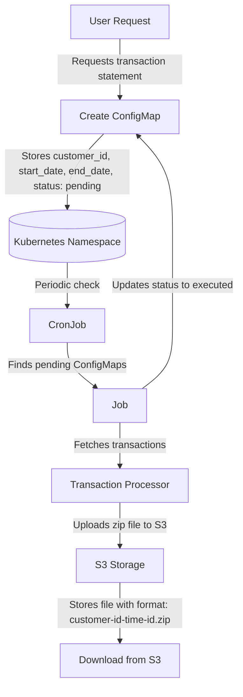

# Transactions Collector
This Implementes a system that allows users to request transaction statements for specific durations.
The solution leverages Kubernetes, ConfigMaps, Jobs, and CronJobs to efficiently handle and process these requests, and utilizes S3 for storing and downloading the generated statements.


# Banking Application: Transaction Statement Generation


## Overview

This project covers the design and implementation of a system that allows users to request transaction statements for specific durations. The solution leverages Kubernetes, ConfigMaps, Jobs, and CronJobs to efficiently handle and process these requests, and utilizes S3 for storing and downloading the generated statements.

## Architecture

1. **User Request:**
   - Users request transaction statements for a specified duration.
   - The request includes `customer_id`, `start_date`, and `end_date`.

2. **ConfigMap Creation:**
   - Each request is converted into a Kubernetes ConfigMap containing:
     - `customer_id`
     - `start_date`
     - `end_date`
     - `status: pending`

3. **Namespace:**
   - A dedicated Kubernetes namespace is created to manage these ConfigMaps and Jobs.

4. **CronJob Processing:**
   - A Kubernetes CronJob periodically checks for ConfigMaps with `status: pending`.

5. **Job Execution:**
   - For each pending ConfigMap, a Job is created to process the transaction data and upload the result to S3.
   - The Job updates the ConfigMap status to `executed` upon completion.

6. **S3 Storage:**
   - The processed transaction data is stored in S3 with the filename format:
     - `<customer-id>-epoc(<startdate>)-epoc(<enddate>)-<upload-time>.zip`

7. **Download:**
   - Users can download the transaction statement from S3.

## Pros of the Design

1. **Scalability:**
   - Leveraging Kubernetes Jobs allows the system to scale efficiently with the number of requests.

2. **Automation:**
   - The process is automated, reducing the need for manual intervention.

3. **Reliability:**
   - Using S3 for storage ensures high availability and durability of the transaction statements.

4. **Resource Management:**
   - Kubernetes manages the resource allocation, ensuring optimal usage.

5. **Status Tracking:**
   - The status of each request is tracked in the ConfigMap, providing visibility and control.

## Cons of the Design

1. **Complexity:**
   - Setting up and maintaining the Kubernetes environment can be complex and require expertise.

2. **Cost:**
   - Running Jobs and storing data in S3 incurs costs, which can grow with the number of requests.

3. **Latency:**
   - There may be a delay in processing and uploading the transaction statements, especially for large datasets.

4. **Failure Handling:**
   - Implementing robust failure handling and retries for Jobs and S3 uploads is essential but adds complexity.

5. **Security:**
   - Ensuring the security of transaction data during processing and storage requires diligent attention.

## Implementation

### ConfigMap Example

```yaml
apiVersion: v1
kind: ConfigMap
metadata:
  name: transaction-request-<customer-id>-<timestamp>
  namespace: transaction-requests
data:
  customer_id: "<customer_id>"
  start_date: "<start_date>"
  end_date: "<end_date>"
  status: "pending"
